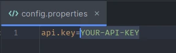

# 🚀 Challenge Conversor de Monedas

¡Bienvenido a **Conversor de Monedas**"!

El proyecto se trata de convertir monedas en diferentes tipos de cambio utilizando el servicio API, **ExchangeRateAPI**.

## 🖼️ Vista Previa

<p align="left">
  
</p>

## 🧰 Tecnologías utilizadas

- 🧠 Lenguaje principal: **Java 21.**
- 🗃️ API: **ExchangeRateAPI**

## ⚙️ Características Principales

- 🧮 Tablero con opciones de conversión.
- 💱Ingreso de opcion de tipo de cambio.
- 💰 Ingreso de monto a convertir.

## 🧪 Como ejecutar el proyecto

```bash
# Clona el repositorio
git clone https://github.com/smithmilla/challenge-conversor-moneda.git

# Entra al directorio
cd challenge-conversor-monedas
```

## 🚨 Importante
Es importante considerar que a la hora de ejecutar el programa 
será necesario que ingrese su `API-KEY` en la siguiente ruta:

<p align="center">
  
</p>

Cambiar la línea resaltada `YOUR-API-KEY` por su clave `API-KEY`.

<p align="center">
  
</p>


## 🙌 Contribuciones
¡Las contribuciones son bienvenidas! Siéntete libre de abrir un issue o hacer un pull request.

## 📄 Licencia
Este proyecto está bajo la licencia MIT.

## ✨ Autor
Desarrollado con 💪‍🧑‍💻️ por [smithmilla](https://github.com/smithmilla/)
<p align="left">
    
</p>